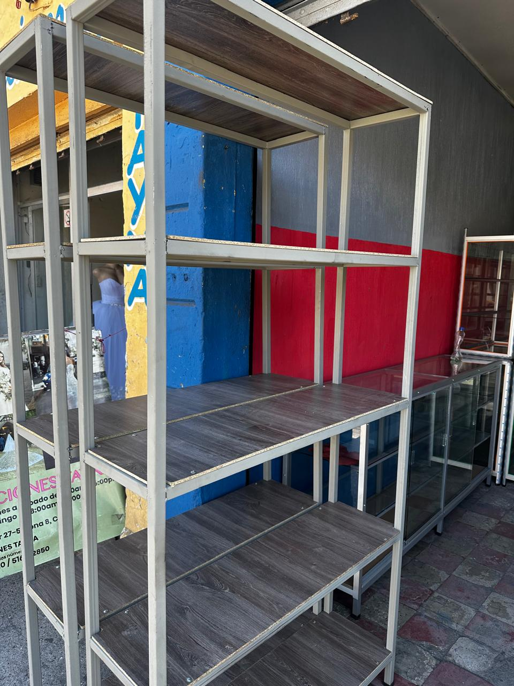
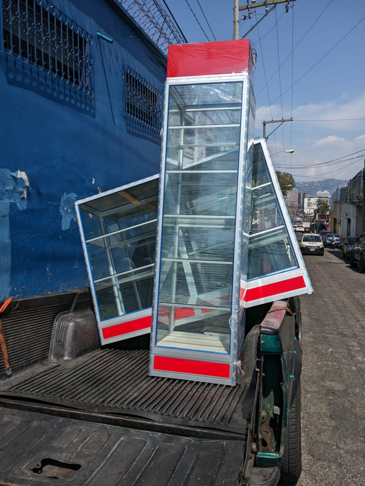
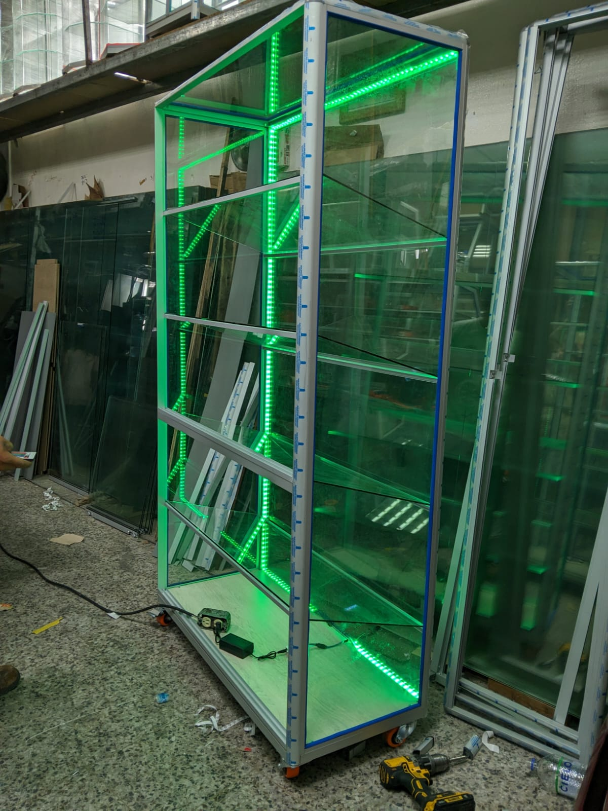
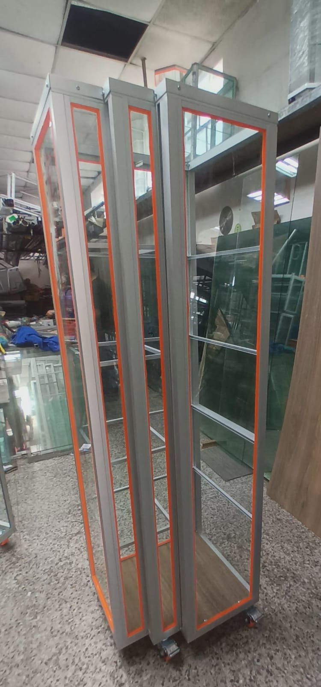
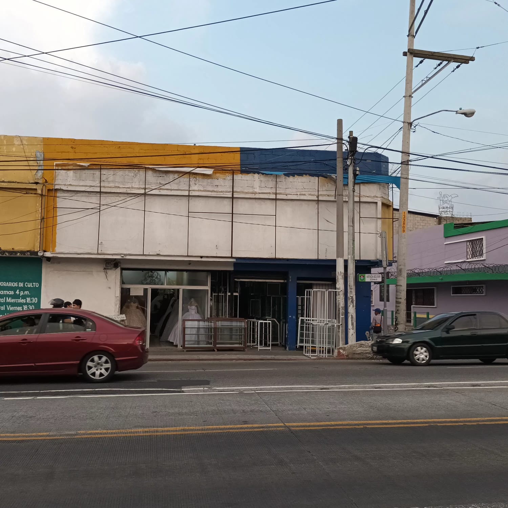
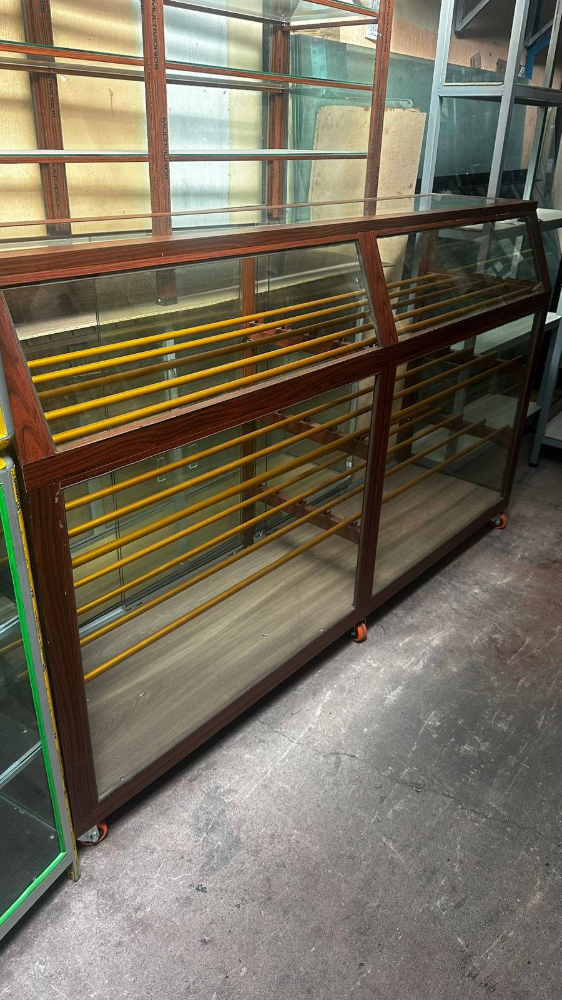

# Evidencias de Entrevistas

## Negocio 1 — Vidriería

*Audio de la entrevista:*
[Escuchar audio](https://drive.google.com/file/d/1nwpHyEyN6kEBSp_YQ-fpldlxIwwtqH2H/view?usp=sharing)

*Descripción:* Audio de la entrevista realizada el [12/04/2026] 
al dueño de la vidriería [Vidreria La Bendición], 
ubicada en [Zona 1, Ciudad de Guatemala]. Entrevistadores: [Cesar Emmanuel Cipriano López y Diego Enrique Flores Ruíz].

| Imagen 1 | Imagen 2 | Imagen 3 |
|----------|----------|----------|
|  |  |  |

| Imagen 4 | Imagen 5 | Imagen 6 |
|----------|----------|----------|
|  |  |  |

---

## Negocio 2 — Taller de Herrería

*Audio de la entrevista:*
[Escuchar audio](https://drive.google.com/file/d/14vOITkP-uLDM1HpgJMiZz-X-RLH6OXxK/view?usp=sharing)

*Descripción:* Audio de la entrevista realizada el [12/04/2026] 
al dueño del taller de herrería [Herreria El Rey], 
ubicada en [Departamento de Sacatepéquez, Sumpango]. Entrevistadores: [Wagner Maximiliano Ley Monroy, Daniel Estuardo Chicoj Bolaños y Diego Rene Estrada Júarez].
