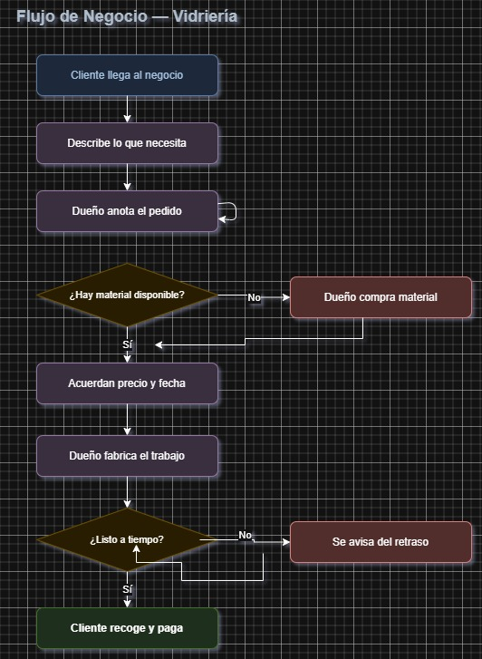
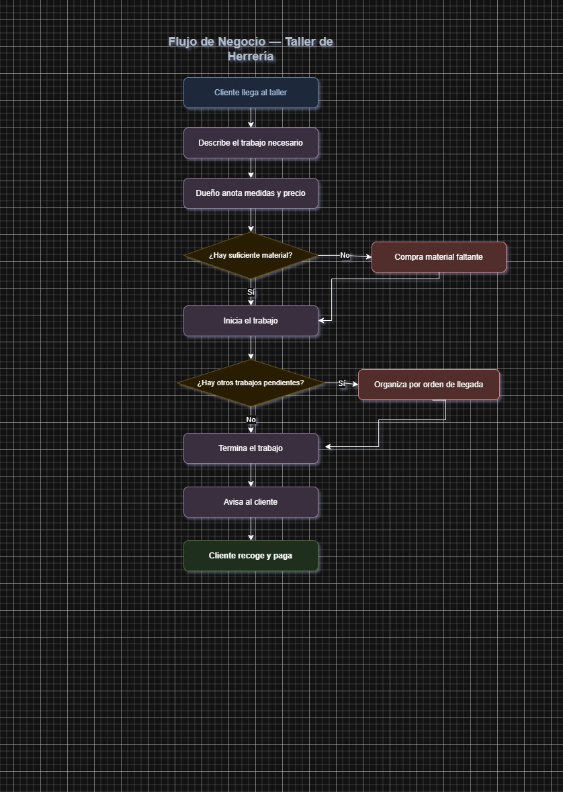

## Flujo de negocios

A continuación se presentan las dos etapas principales del proceso:

### Diagrama 1 — Captación de clientes

*Figura 1. Proceso de captación desde el primer contacto hasta la conversión.*

---

### Diagrama 2 — Entrega y posventa

*Figura 2. Etapas de entrega del producto o servicio y seguimiento posventa.*
