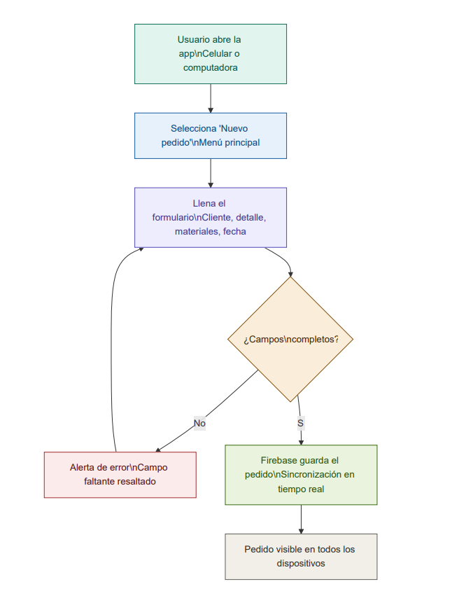

# Flujo de la solución

## Descripción general

A partir de los problemas identificados en las entrevistas realizadas a los negocios de **vidriería** y **herrería**, se encontró una necesidad crítica común: la ausencia de un sistema organizado para el registro y seguimiento de pedidos. Esto generaba olvido de detalles importantes, pérdida de información de clientes y desconocimiento del estado del inventario de materiales.

Como solución, el equipo propone el desarrollo de una **aplicación web responsive** accesible desde dispositivos móviles y computadoras de escritorio, respaldada por **Firebase** (Google) como base de datos en la nube con sincronización en tiempo real.

---

## Diagrama 1 — Arquitectura del sistema

Muestra las cuatro capas del sistema: desde el punto de acceso del usuario hasta el almacenamiento persistente en la nube.

## Diagrama 2 — Flujo de registro de un pedido

Muestra paso a paso qué ocurre cuando un usuario registra un nuevo encargo, incluyendo la validación de datos y el guardado en Firebase.

## Capas del sistema

### Capa 1 — Acceso del usuario

| Dispositivo | Descripción |
|---|---|
| Celular / tablet | Acceso desde el navegador web móvil, sin instalar nada |
| Computadora | Acceso desde el navegador de escritorio o laptop |

---

### Capa 2 — Interfaz web (frontend)

Tres módulos principales accesibles desde el menú de la aplicación:

#### Módulo: Nuevo pedido
- **Formulario:** El usuario ingresa nombre del cliente, detalle del encargo, materiales requeridos, fecha de entrega y notas.
- **Validación:** El sistema verifica que todos los campos obligatorios estén completos antes de guardar. Si falta alguno, muestra una alerta con el campo resaltado.

#### Módulo: Ver pedidos
- **Listado:** Muestra todos los pedidos registrados con opciones de búsqueda y ordenamiento por fecha, cliente o estado.
- **Detalle:** Al seleccionar un pedido se visualizan todos sus datos: estado actual, materiales, notas del encargo.

#### Módulo: Inventario
- **Stock actual:** Consulta en tiempo real de materiales disponibles (vidrio, aluminio, hierro, etc.).
- **Actualización automática:** El stock se descuenta al registrar o cerrar un pedido.

---

### Capa 3 — Backend en la nube (Firebase)

| Característica | Beneficio para el negocio |
|---|---|
| Sincronización en tiempo real | Cambios visibles al instante en todos los dispositivos |
| Sin servidor propio | Reduce costos de mantenimiento |
| Seguridad de Google | Datos protegidos sin configuración técnica avanzada |
| Gratuito en escala pequeña | Ideal para negocios medianos y pequeños |

---

### Capa 4 — Almacenamiento persistente

| Colección | Contenido |
|---|---|
| `pedidos` | Historial completo de todos los encargos |
| `clientes` | Datos de contacto de clientes frecuentes |
| `materiales` | Inventario con cantidades disponibles |

---

## Justificación tecnológica

| Decisión | Justificación |
|---|---|
| Aplicación web (no nativa) | No requiere instalación; funciona desde cualquier navegador |
| Firebase como backend | Fácil de implementar, tiempo real, gratuito a pequeña escala |
| Diseño responsive | Los negocios operan principalmente desde celulares |
| Sin servidor propio | Elimina costos de hosting y mantenimiento de infraestructura |

---

> Este diagrama fue construido a partir de la información obtenida en las entrevistas realizadas a los negocios seleccionados, y representa la solución acordada durante la simulación de la junta directiva técnica del equipo.
