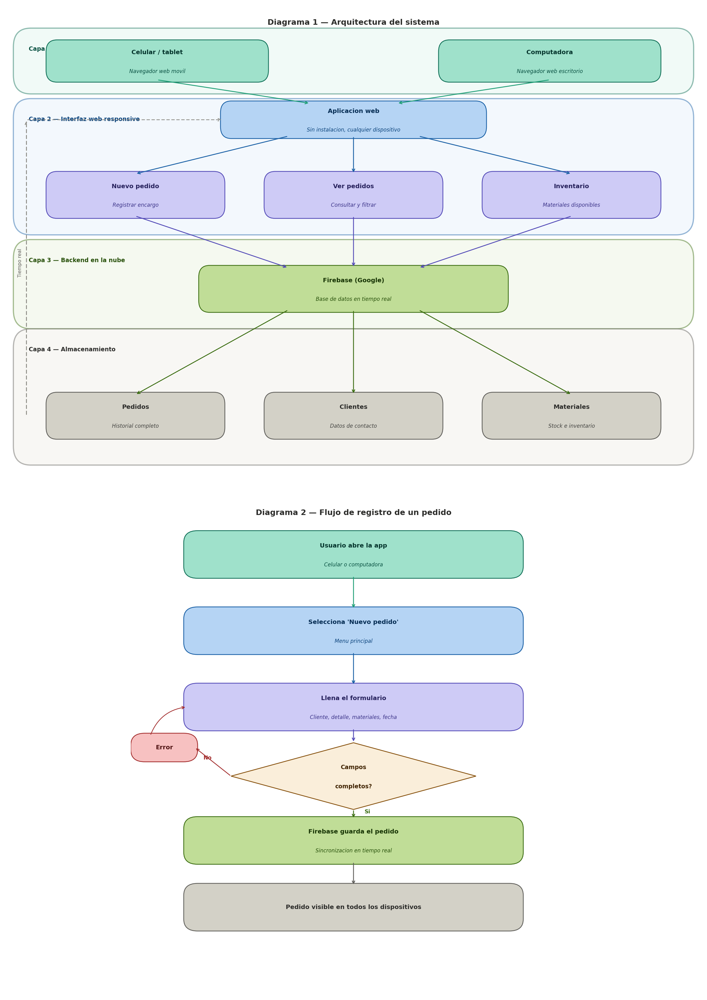

# Flujo de la solución

## Descripción general

A partir de los problemas identificados en las entrevistas realizadas a los negocios de **vidriería** y **herrería**, se encontró una necesidad crítica común: la ausencia de un sistema organizado para el registro y seguimiento de pedidos. Esto generaba olvido de detalles importantes, pérdida de información de clientes y desconocimiento del estado del inventario de materiales.

Como solución, el equipo propone el desarrollo de una **aplicación web responsive** accesible desde dispositivos móviles y computadoras de escritorio, respaldada por **Firebase** (Google) como base de datos en la nube con sincronización en tiempo real.

---

## Diagrama 1 — Arquitectura del sistema

Muestra las cuatro capas del sistema: desde el punto de acceso del usuario hasta el almacenamiento persistente en la nube.

## Diagrama 2 — Flujo de registro de un pedido

Muestra paso a paso qué ocurre cuando un usuario registra un nuevo encargo, incluyendo la validación de datos y el guardado en Firebase.

