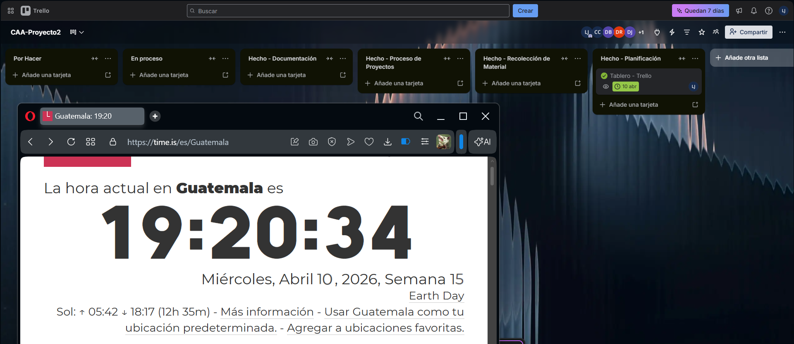

# Tablero de TRELLO
Para la gestión del proyecto se utilizó **Trello** como herramienta principal de planificación, aprovechando su sistema de tableros Kanban que permite visualizar el flujo de trabajo de manera estructurada. El tablero **CAA-Proyecto2** fue organizado en cuatro columnas principales, cada una representando una fase completada del proyecto.

---

  

---

  

---

## Hecho — Planificación
Esta columna refleja las actividades iniciales que sentaron las bases del proyecto.

### Reunión - Repartición de documentación *(20 abr)*
Se realizó una reunión grupal con todos los integrantes del equipo con el objetivo de distribuir  las responsabilidades de documentación. Esta actividad fue fundamental para garantizar que cada miembro tuviera claridad sobre su rol y sus entregables dentro del proyecto.

### Reunión - Elección de negocios *(12 abr)*
Se llevó a cabo una sesión de discusión grupal para evaluar y seleccionar los negocios que serían objetos a entrevistar para del proyecto. La toma de decisión fue colectiva, asegurando que todos los integrantes estuvieran alineados con el enfoque del trabajo.

### Tablero - Trello *(10 abr)*
Se configuró y estructuró el tablero de Trello como herramienta central de seguimiento del proyecto. Esta tarjeta evidencia que la organización del equipo fue planificada desde el inicio, estableciendo un flujo de trabajo claro antes de comenzar cualquier actividad.

---

## Hecho — Recolección de Material
Esta columna agrupa las actividades de campo realizadas para obtener información de primera mano.

### Pitch - Vidrería y Herrería *(13 abr)*
Cada miembro del equipo de trabajo grabó y subió a youtube un pitch con una porpuesta al dueño del negocio entrevistado sobre un rquerimiento uidentificado en su negocio para sacarle provecho a la plataforma web que se le ofreció. 

### Grabación de entrevista 1 y 2 - Vidrería y Herrería *(12 abr)*
Se realizó la visita y presentación a los negocios para recolectar fotografías. se realizó y grabó la entrevista formal al representante del negocio de vidrería. La tarjeta incluye un archivo adjunto y una lista de verificación completada, lo que evidencia que el material audiovisual fue recolectado y verificado correctamente.

---

## Hecho — Proceso de Proyectos
Esta columna documenta las actividades de seguimiento y comunicación interna del equipo.

### Reportar - Issues del Proyecto *(22 abr)*
Se registraron y reportaron los problemas identificados durante el desarrollo de los programas de cada negocio. Esta práctica refleja una gestión proactiva de riesgos, permitiendo al equipo atender y resolver obstáculos de manera oportuna.

### Junta - Discusión de Proyecto *(19 abr)*
Se realizó una reunión general con todos los integrantes para revisar el avance del proyecto y concluir los acuerdos establecidos con los dueños de los negocios, además de esto se subió a youtube para su transparencia.

---

## Hecho — Documentación
Esta columna concentra todas las tareas relacionadas con la elaboración y entrega de los documentos del proyecto.

### Documentación - Docusaurus *(22 abr)*
Se completó la documentación del proyecto utilizando Docusaurus como plataforma de publicación. La lista de verificación confirma que el entregable fue finalizado en su totalidad dentro de la fecha establecida.

### 01 - Recolección de información *(21 abr)*
Se entregó la sección correspondiente a la recolección de información del informe, consolidando los datos obtenidos durante las visitas y entrevistas realizadas.

### 02 - Análisis *(21 abr)*
Se desarrolló la sección de análisis del informe, procesando e interpretando la información recolectada para extraer conclusiones relevantes sobre los negocios estudiados.

### 03 - Propuesta *(21 abr)*
Sección de pitch y reglas del negocio para los programas a trabajar.

### Anexos *(21 abr)*
Se compilaron y organizaron todos los materiales de soporte del proyecto, incluyendo evidencias, fotografías y cualquier otro documento complementario que respalde el trabajo realizado.

### Estructura y directores - Repositorio *(10 abr)* 
Se definió la estructura del repositorio del proyecto y se asignaron los roles de dirección dentro del equipo. Con su lista de verificación completada y archivo adjunto, evidencia que la organización técnica del proyecto fue establecida desde las etapas tempranas.

---

El uso de Trello permitió al equipo mantener visibilidad completa sobre el estado de cada actividad, facilitando la coordinación, el cumplimiento de fechas y la distribución equitativa del trabajo entre todos los integrantes.
